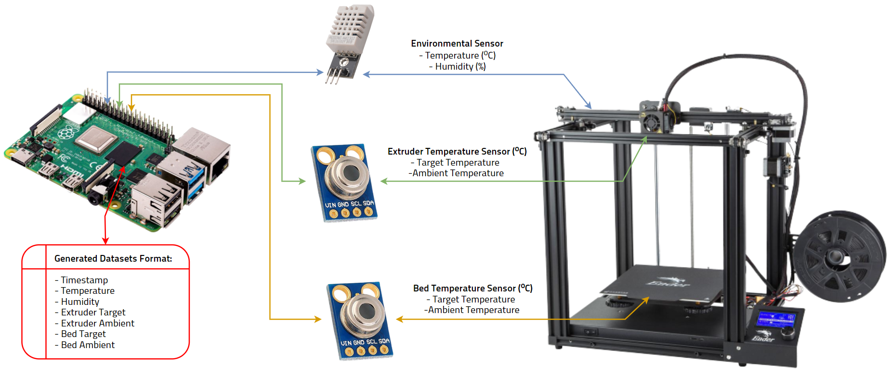
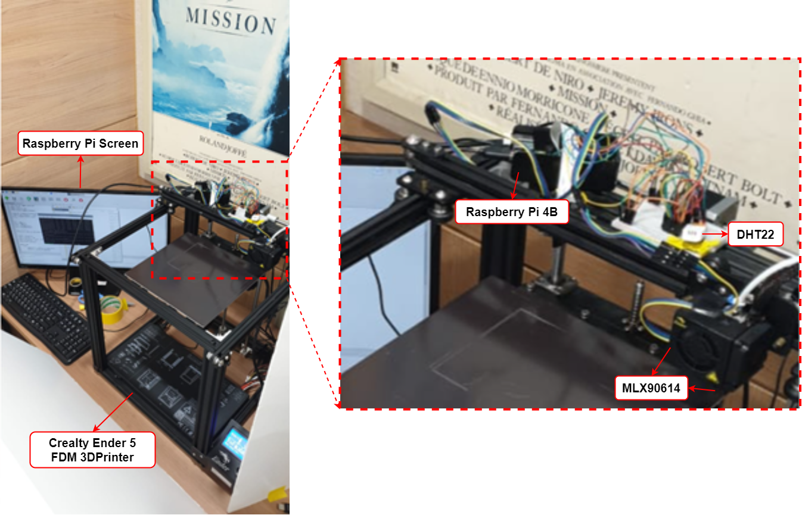
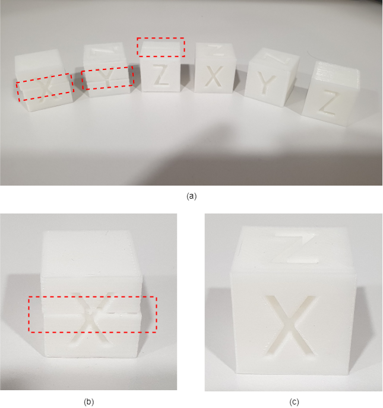

# Fused Deposition Modeling 3D Printer Fault Detection Dataset using Sensory Data.

### The presented Dataset is gathered using following configurations:

### Real-world implementation:

### Samples of printed product:

